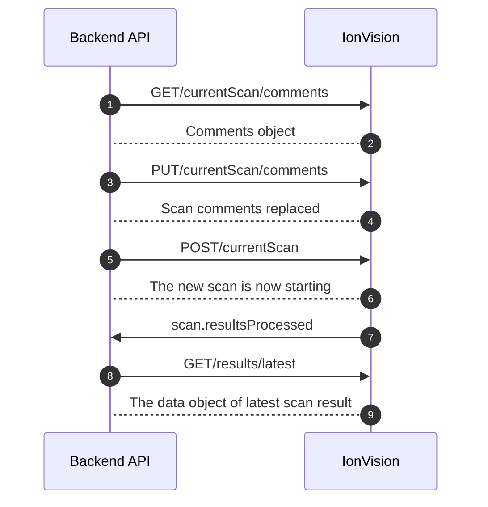

# IonVision Adapter Documentation

Main adapter interface for IonVision device communication via the HTTP and
WebSocket APIs.
**IonVision HTTP API Documentation**: https://olfactomics.github.io/IonVision-API-docs/
**IonVision WebSocket API Documentation**: https://github.com/Olfactomics/IonVision-API-docs/blob/main/IonVision-WS-API.md

## Key Responsibilities

1. **HTTP API wrapper:** Methods for scan management.
   Most importants: get_scan_comments(), replace_scan_comments(comments:dict), start_new_scan(),
   get_current_scan(), get_latest_dataobject()

2. **WebSocket event handling**
   Lifecycle management and event registration for real-time device notifications.

## Core HTTP Methods

**get_scan_comments()** <br>
Get the comments object associated with the ongoing or next scan.
The comments object is automatically reset once a scan finishes
and the previous comments object is saved to the result file
of the just finished scan.

**replace_scan_comments(comments:dict)** <br>
Parameters:

- `comments` (dict): Key-value pairs representing scan comments/metadata to store

Description: <br>
Add comments to the ongoing or next scan. Replaces the previous comments object.
The /currentScan/comments object can first be fetched for editing using GET.

**get_current_scan()** <br>
Check if a scan is ongoing and get information about it.

**get_latest_dataobject()** <br>
Get the data object of the latest scan result once it has been processed.
Please note that it can take some time for the device to process the scan
result data after a scan has already been finished.

## Core WebSocket Methods

IonVision websocket traffic is one-way from the device to the client. Each
message is a JSON object with `type`, `time`, and `body` keys. The adapter
passes that full parsed message to registered handlers.

Example:

```json
{
    "type": "controllers.status",
    "time": 1616057824108,
    "body": {
        "status": {
            "rtmReady": true
        }
    }
}
```

**initialize_websocket()** <br>
Initialize WebSocket connection for event streaming.
Must be called after instantiation to open the WebSocket.

**disconnect_websocket()** <br>
Close WebSocket connection and stop listening for events.

**on_event(event_type: str, handler: Callable[[Dict[str, Any]], Any])** <br>
Parameters:

- event_type: The type of event to listen for (e.g., "message.error", "scan.finished")
- handler: Async or sync callable that receives the full websocket message
  object with `type`, `time`, and `body`

Description:
Register a handler for a WebSocket event.

**off_event(event_type: str, handler: Callable[[Dict[str, Any]], Any])** <br>
Parameters:

- event_type: The type of event to stop listening for (e.g., "message.error", "scan.finished")
- handler: The previously registered callback to remove

Description:
Unregister a handler for a WebSocket event.

## Internal Architecture

- Delegates WebSocket management to WebSocketAdapter class
- Returns IVResult objects (with ok, payload, error fields) for HTTP calls
- Dispatches websocket events by `type`
- Keeps the full documented IonVision websocket envelope intact for handlers

## Sequence Diagram: Successful IonVision-Backend Communication Flow



# IonVision Hardware Test

This is a manual hardware coverage test for a real IonVision machine. It exercises the
same `IVAdapter` code that the backend uses.

here is the output of the test run on a real machine with the default settings and no optional checks enabled:

```bash
============================= test session starts ==============================
platform darwin -- Python 3.10.8, pytest-8.3.2, pluggy-1.6.0
rootdir: /Users/jb/Documents/DEV/TUNI/PROJ/nenabot-main
configfile: pytest.ini
plugins: anyio-4.12.1, respx-0.22.0, cov-4.0.0
collected 13 items

test_ionVision_hardware.py ping payload:
{
  "parameter": {
    "id": "32283638-3c6a-4e7e-afd5-eb23a3a667a9",
    "name": "Laser Wellplate"
  }
}
.currentParameter payload:
{
  "parameter": {
    "id": "32283638-3c6a-4e7e-afd5-eb23a3a667a9",
    "name": "Laser Wellplate"
  }
}
.start_new_scan payload:
{
  "message": "The scan is starting"
}
currentScan payload:
{
  "information": {},
  "progress": 99
}
stop_current_scan payload:
{
  "message": "The scan is stopping"
}
.currentScan/comments payload:
{}
.results query:
{
  "end_date": "2026-03-25T13:01:11.874Z",
  "ids": "",
  "max_results": 100,
  "only_metadata": true,
  "page": 1,
  "search": "",
  "sort_by": "date_dsc",
  "start_date": "2026-03-17T13:01:11.874Z"
}
results payload:
{
  "meta": {
    "maxResults": 100,
    "page": 1,
    "totalResults": 120
  },
  "results": [
    {
      "Comments": {},
      "FinishTime": "2026-03-24T14:00:55.563Z",
      "Id": "371a6a5c-6706-48f8-b3cf-206af1bcd36a",
      "Measurer": "Laser",
      "Parameters": "32283638-3c6a-4e7e-afd5-eb23a3a667a9",
      "Project": "Wellplate setup",
      "StartTime": "2026-03-24T14:00:40.378Z"
    },
    {
      "Comments": {},
      "FinishTime": "2026-03-24T13:59:09.450Z",
      "Id": "598c29bd-93eb-4c18-bf83-2e2548ae2980",
      "Measurer": "Laser",
      "Parameters": "32283638-3c6a-4e7e-afd5-eb23a3a667a9",
      "Project": "Wellplate setup",
      "StartTime": "2026-03-24T13:58:54.277Z"
    },
    {
      "Comments": {},
      "FinishTime": "2026-03-24T13:58:31.927Z",
      "Id": "9f4cedfd-8aff-4026-8764-cbc6dba81c01",
      "Measurer": "Laser",
      "Parameters": "32283638-3c6a-4e7e-afd5-eb23a3a667a9",
      "Project": "Wellplate setup",
      "StartTime": "2026-03-24T13:58:16.736Z"
    },
    {
      "Comments": {},
      "FinishTime": "2026-03-24T13:58:15.598Z",
      "Id": "3ff44911-74e8-4a65-b713-c80183814e0d",
      "Measurer": "Laser",
      "Parameters": "32283638-3c6a-4e7e-afd5-eb23a3a667a9",
      "Project": "Wellplate setup",
      "StartTime": "2026-03-24T13:58:00.423Z"
    },
    {
      "Comments": {},
      "FinishTime": "2026-03-24T13:20:37.077Z",
      "Id": "ca3b34fd-8474-4613-a329-7b86e449a5bf",
      "Measurer": "Laser",
      "Parameters": "32283638-3c6a-4e7e-afd5-eb23a3a667a9",
      "Project": "Wellplate setup",
      "StartTime": "2026-03-24T13:20:21.886Z"
    },
    {
      "Comments": {},
      "FinishTime": "2026-03-24T12:13:56.129Z",
      "Id": "b654a4c3-db18-4e0b-b549-aeec5d0cbc5d",
      "Measurer": "Laser",
      "Parameters": "32283638-3c6a-4e7e-afd5-eb23a3a667a9",
      "Project": "Wellplate setup",
      "StartTime": "2026-03-24T12:13:40.931Z"
    },
    {
      "Comments": {
        "comment": "Test comment at 1774354321.755251"
      },
      "FinishTime": "2026-03-24T12:12:25.284Z",
      "Id": "9ba94568-7d77-446f-b756-06fe5af6e344",
      "Measurer": "Laser",
      "Parameters": "318a148c-b6f0-4e30-98bc-a2e09c0ab579",
      "Project": "Laser",
      "StartTime": "2026-03-24T12:12:01.839Z"
    },
    {
      "Comments": {},
      "FinishTime": "2026-03-24T12:11:47.884Z",
      "Id": "9318ee6c-7385-48cc-bb5e-c2f90e3adbf2",
      "Measurer": "Laser",
      "Parameters": "318a148c-b6f0-4e30-98bc-a2e09c0ab579",
      "Project": "Laser",
      "StartTime": "2026-03-24T12:11:24.467Z"
    },
    {
      "Comments": {},
      "FinishTime": "2026-03-24T11:47:43.360Z",
      "Id": "e66d774f-4f8a-4ed3-b87c-1d796fd7c8ce",
      "Measurer": "Laser",
      "Parameters": "318a148c-b6f0-4e30-98bc-a2e09c0ab579",
      "Project": "Laser",
      "StartTime": "2026-03-24T11:47:19.932Z"
    },
    {
      "Comments": {},
      "FinishTime": "2026-03-24T11:44:33.545Z",
      "Id": "9e0a3050-8d12-401f-875f-de7533c3ecbf",
      "Measurer": "Laser",
      "Parameters": "665fa0e2-f4d8-4895-b611-aebb00593faf",
      "Project": "Laser",
      "StartTime": "2026-03-24T11:44:17.098Z"
    },
    {
      "Comments": {},
      "FinishTime": "2026-03-24T11:43:39.475Z",
      "Id": "730980c1-6f81-43bf-8fc5-a76bd190049d",
      "Measurer": "Laser",
      "Parameters": "665fa0e2-f4d8-4895-b611-aebb00593faf",
      "Project": "Laser",
      "StartTime": "2026-03-24T11:43:17.945Z"
    },
    {
      "Comments": {},
      "FinishTime": "2026-03-24T11:38:53.873Z",
      "Id": "8a0beea4-4ecb-422b-a3a3-8a69147835fc",
      "Measurer": "Laser",
      "Parameters": "665fa0e2-f4d8-4895-b611-aebb00593faf",
      "Project": "Laser",
      "StartTime": "2026-03-24T11:38:32.360Z"
    },
    {
      "Comments": {},
      "FinishTime": "2026-03-24T11:36:56.562Z",
      "Id": "1ad5c2c8-ca54-4dd3-8a5d-b18cc84d56e5",
      "Measurer": "Laser",
      "Parameters": "665fa0e2-f4d8-4895-b611-aebb00593faf",
      "Project": "Laser",
      "StartTime": "2026-03-24T11:36:35.021Z"
    },
    {
      "Comments": {},
      "FinishTime": "2026-03-24T11:35:51.833Z",
      "Id": "686fd28e-a7af-4189-9501-7e73cd05a786",
      "Measurer": "Laser",
      "Parameters": "665fa0e2-f4d8-4895-b611-aebb00593faf",
      "Project": "Laser",
      "StartTime": "2026-03-24T11:35:30.286Z"
    },
    {
      "Comments": {},
      "FinishTime": "2026-03-24T11:33:43.133Z",
      "Id": "705accef-ce50-446e-b182-9a40a0df00a5",
      "Measurer": "Laser",
      "Parameters": "665fa0e2-f4d8-4895-b611-aebb00593faf",
      "Project": "Laser",
      "StartTime": "2026-03-24T11:33:26.685Z"
    },
    {
      "Comments": {},
      "FinishTime": "2026-03-24T11:31:34.233Z",
      "Id": "c588f1df-e536-4fce-a94f-07a3253448eb",
      "Measurer": "Laser",
      "Parameters": "665fa0e2-f4d8-4895-b611-aebb00593faf",
      "Project": "Laser",
      "StartTime": "2026-03-24T11:31:17.781Z"
    },
    {
      "Comments": {},
      "FinishTime": "2026-03-24T11:30:01.927Z",

... <truncated 44468 chars>
.results/latest payload:
{
  "Comments": {},
  "FinishTime": "2026-03-24T14:00:55.563Z",
  "FormatVersion": 3,
  "Id": "371a6a5c-6706-48f8-b3cf-206af1bcd36a",
  "MeasurementData": {
    "DataPoints": 1200,
    "DataValid": true,
    "IntensityBottom": [
      203.608,
      -1.948,
      -2.013,
      -2.159,
      -2.321,
      -2.094,
      -6.996,
      -15.34,
      -25.598,
      -86.81,
      -195.161,
      -190.08,
      -138.575,
      -74.198,
      -21.524,
      -5.422,
      -2.906,
      -2.484,
      -2.126,
      -2.078,
      -2.208,
      -2.289,
      -2.337,
      -2.208,
      -2.402,
      -2.224,
      -2.24,
      -2.11,
      -2.337,
      -2.062,
      -2.175,
      -2.273,
      -2.11,
      -2.289,
      -2.24,
      -2.159,
      -2.224,
      -2.337,
      -2.191,
      -2.305,
      -2.256,
      -2.11,
      -2.078,
      -2.37,
      -2.224,
      -2.402,
      -2.013,
      -2.029,
      -2.175,
      -2.24,
      -2.159,
      -2.224,
      -2.191,
      -2.273,
      -2.337,
      -2.143,
      -2.467,
      -2.143,
      -2.191,
      -2.078,
      -2.597,
      -2.11,
      -2.337,
      -2.321,
      -2.159,
      -2.289,
      -3.068,
      -4.253,
      -9.512,
      -28.098,
      -72.64,
      -126.255,
      -204.738,
      -194.008,
      -77.233,
      -19.495,
      -4.675,
      -2.5,
      -2.094,
      -2.321,
      -1.997,
      -2.435,
      -2.224,
      -2.208,
      -2.289,
      -2.191,
      -2.24,
      -2.208,
      -2.078,
      -2.273,
      -2.256,
      -2.24,
      -2.208,
      -2.24,
      -2.467,
      -2.289,
      -2.126,
      -2.143,
      -2.224,
      -2.289,
      -2.337,
      -2.191,
      -2.062,
      -2.337,
      -2.289,
      -2.191,
      -2.013,
      -2.208,
      -2.305,
      -2.337,
      -2.321,
      -2.354,
      -2.386,
      -2.208,
      -2.11,
      -2.37,
      -2.224,
      -2.273,
      -2.208,
      -2.191,
      -2.305,
      -2.224,
      -2.078,
      -2.273,
      -2.191,
      -2.435,
      -2.435,
      -3.182,
      -6.671,
      -9.853,
      -19.105,
      -26.929,
      -34.591,
      -72.851,
      -116.954,
      -157.064,
      -120.346,
      -62.478,
      -15.648,
      -3.733,
      -2.224,
      -2.289,
      -2.11,
      -2.305,
      -2.273,
      -2.224,
      -2.078,
      -2.126,
      -2.289,
      -2.208,
      -2.224,
      -2.354,
      -2.143,
      -2.094,
      -2.305,
      -2.256,
      -2.094,
      -2.126,
      -2.273,
      -2.289,
      -2.289,
      -2.191,
      -2.175,
      -2.289,
      -2.029,
      -2.175,
      -2.337,
      -2.143,
      -2.175,
      -2.224,
      -2.126,
      -2.126,
      -2.224,
      -2.062,
      -2.094,
      -2.094,
      -2.24,
      -2.094,
      -2.143,
      -2.24,
      -2.337,
      -2.305,
      -2.062,
      -2.224,
      -2.289,
      -2.062,
      -2.63,
      -2.873,
      -4.155,
      -7.921,
      -11.622,
      -15.729,
      -17.433,
      -17.58,
      -17.807,
      -17.385,
      -27.27,
      -66.423,
      -112.977,
      -85.723,
      -72.786,
      -32.189,
      -9.252,
      -3.149,
      -2.386,
      -2.419,
      -2.321,
      -2.484,
      -2.208,
      -2.224,
      -2.321,
      -2.159,
      -2.305,
      -2.208,
      -2.159,
      -2.37,
      -2.208,
      -2.289,
      -2.289,
      -1.964,
      -2.435,
      -2.273,
      -2.175,
      -2.419,
      -2.191,
      -2.273,
      -2.191,
      -2.175,
      -2.159,
      -2.11,
      -2.321,
      -2.126,
      -2.013,
      -2.386,
      -2.143,
      -2.386,
      -2.305,
      -1.948,
      -2.354,
      -2.224,
      -2.337,
      -2.143,
      -2.191,
      -2.062,
      -2.175,
      -2.354,
      -2.289,
      -2.548,
      -3.425,
      -5.162,
      -8.116,
      -10.275,
      -11.038,
      -12.629,
      -11.249,
      -10.843,
      -9.788,
      -9.366,
      -9.772,
      -9.983,
      -13.116,
      -15.502,
      -29.137,
      -64.718,
      -68.419,
      -54.605,
      -32.172,
      -13.716,
      -4.886,
      -2.727,
      -2.321,
      -2.289,
      -2.11,
      -2.305,
      -2.289,
      -2.224,
      -2.078,
      -2.386,
      -2.305,
      -2.175,
      -2.256,
      -2.273,
      -2.354,
      -2.143,
      -2.354,
      -2.126,
      -2.305,
      -2.256,
      -2.175,
      -2.451,
      -2.159,
      -2.532,
      -2.094,
      -2.045,
      -2.256,
      -1.98,
      -2.11,
      -2.354,
      -2.159,
      -2.337,
      -2.175,
      -2.208,
      -2.24,
      -2.126,
      -2.289,
      -2.256,
      -2.419,
      -2.435,
      -3.311,
      -4.35,
      -5.714,
      -7.84,
      -8.571,
      -8.701,
      -8.912,
      -8.278,
      -7.564,
      -7.613,
      -7.094,
      -7.094,
      -6.655,
      -5.487,
      -5.292,
      -4.967,
      -5.616,
      -8.278,
      -8.554,
      -10.665,
      -11.606,
      -16.979,
      -25.501,
      -39.006,
      -44.022,
      -33.942,
      -18.667,
      -8.619,
      -4.074,
      -2.548,

... <truncated 119768 chars>
.results/id/371a6a5c-6706-48f8-b3cf-206af1bcd36a payload:
{
  "Comments": {},
  "FinishTime": "2026-03-24T14:00:55.563Z",
  "FormatVersion": 3,
  "Id": "371a6a5c-6706-48f8-b3cf-206af1bcd36a",
  "MeasurementData": {
    "DataPoints": 1200,
    "DataValid": true,
    "IntensityBottom": [
      203.608,
      -1.948,
      -2.013,
      -2.159,
      -2.321,
      -2.094,
      -6.996,
      -15.34,
      -25.598,
      -86.81,
      -195.161,
      -190.08,
      -138.575,
      -74.198,
      -21.524,
      -5.422,
      -2.906,
      -2.484,
      -2.126,
      -2.078,
      -2.208,
      -2.289,
      -2.337,
      -2.208,
      -2.402,
      -2.224,
      -2.24,
      -2.11,
      -2.337,
      -2.062,
      -2.175,
      -2.273,
      -2.11,
      -2.289,
      -2.24,
      -2.159,
      -2.224,
      -2.337,
      -2.191,
      -2.305,
      -2.256,
      -2.11,
      -2.078,
      -2.37,
      -2.224,
      -2.402,
      -2.013,
      -2.029,
      -2.175,
      -2.24,
      -2.159,
      -2.224,
      -2.191,
      -2.273,
      -2.337,
      -2.143,
      -2.467,
      -2.143,
      -2.191,
      -2.078,
      -2.597,
      -2.11,
      -2.337,
      -2.321,
      -2.159,
      -2.289,
      -3.068,
      -4.253,
      -9.512,
      -28.098,
      -72.64,
      -126.255,
      -204.738,
      -194.008,
      -77.233,
      -19.495,
      -4.675,
      -2.5,
      -2.094,
      -2.321,
      -1.997,
      -2.435,
      -2.224,
      -2.208,
      -2.289,
      -2.191,
      -2.24,
      -2.208,
      -2.078,
      -2.273,
      -2.256,
      -2.24,
      -2.208,
      -2.24,
      -2.467,
      -2.289,
      -2.126,
      -2.143,
      -2.224,
      -2.289,
      -2.337,
      -2.191,
      -2.062,
      -2.337,
      -2.289,
      -2.191,
      -2.013,
      -2.208,
      -2.305,
      -2.337,
      -2.321,
      -2.354,
      -2.386,
      -2.208,
      -2.11,
      -2.37,
      -2.224,
      -2.273,
      -2.208,
      -2.191,
      -2.305,
      -2.224,
      -2.078,
      -2.273,
      -2.191,
      -2.435,
      -2.435,
      -3.182,
      -6.671,
      -9.853,
      -19.105,
      -26.929,
      -34.591,
      -72.851,
      -116.954,
      -157.064,
      -120.346,
      -62.478,
      -15.648,
      -3.733,
      -2.224,
      -2.289,
      -2.11,
      -2.305,
      -2.273,
      -2.224,
      -2.078,
      -2.126,
      -2.289,
      -2.208,
      -2.224,
      -2.354,
      -2.143,
      -2.094,
      -2.305,
      -2.256,
      -2.094,
      -2.126,
      -2.273,
      -2.289,
      -2.289,
      -2.191,
      -2.175,
      -2.289,
      -2.029,
      -2.175,
      -2.337,
      -2.143,
      -2.175,
      -2.224,
      -2.126,
      -2.126,
      -2.224,
      -2.062,
      -2.094,
      -2.094,
      -2.24,
      -2.094,
      -2.143,
      -2.24,
      -2.337,
      -2.305,
      -2.062,
      -2.224,
      -2.289,
      -2.062,
      -2.63,
      -2.873,
      -4.155,
      -7.921,
      -11.622,
      -15.729,
      -17.433,
      -17.58,
      -17.807,
      -17.385,
      -27.27,
      -66.423,
      -112.977,
      -85.723,
      -72.786,
      -32.189,
      -9.252,
      -3.149,
      -2.386,
      -2.419,
      -2.321,
      -2.484,
      -2.208,
      -2.224,
      -2.321,
      -2.159,
      -2.305,
      -2.208,
      -2.159,
      -2.37,
      -2.208,
      -2.289,
      -2.289,
      -1.964,
      -2.435,
      -2.273,
      -2.175,
      -2.419,
      -2.191,
      -2.273,
      -2.191,
      -2.175,
      -2.159,
      -2.11,
      -2.321,
      -2.126,
      -2.013,
      -2.386,
      -2.143,
      -2.386,
      -2.305,
      -1.948,
      -2.354,
      -2.224,
      -2.337,
      -2.143,
      -2.191,
      -2.062,
      -2.175,
      -2.354,
      -2.289,
      -2.548,
      -3.425,
      -5.162,
      -8.116,
      -10.275,
      -11.038,
      -12.629,
      -11.249,
      -10.843,
      -9.788,
      -9.366,
      -9.772,
      -9.983,
      -13.116,
      -15.502,
      -29.137,
      -64.718,
      -68.419,
      -54.605,
      -32.172,
      -13.716,
      -4.886,
      -2.727,
      -2.321,
      -2.289,
      -2.11,
      -2.305,
      -2.289,
      -2.224,
      -2.078,
      -2.386,
      -2.305,
      -2.175,
      -2.256,
      -2.273,
      -2.354,
      -2.143,
      -2.354,
      -2.126,
      -2.305,
      -2.256,
      -2.175,
      -2.451,
      -2.159,
      -2.532,
      -2.094,
      -2.045,
      -2.256,
      -1.98,
      -2.11,
      -2.354,
      -2.159,
      -2.337,
      -2.175,
      -2.208,
      -2.24,
      -2.126,
      -2.289,
      -2.256,
      -2.419,
      -2.435,
      -3.311,
      -4.35,
      -5.714,
      -7.84,
      -8.571,
      -8.701,
      -8.912,
      -8.278,
      -7.564,
      -7.613,
      -7.094,
      -7.094,
      -6.655,
      -5.487,
      -5.292,
      -4.967,
      -5.616,
      -8.278,
      -8.554,
      -10.665,
      -11.606,
      -16.979,
      -25.501,
      -39.006,
      -44.022,
      -33.942,
      -18.667,
      -8.619,
      -4.074,
      -2.548,

... <truncated 119768 chars>
.results/id/371a6a5c-6706-48f8-b3cf-206af1bcd36a/comments payload:
{}
.currentScan/comments after mutation:
{
  "codexHardwareTestMarker": "codex-hardware-test-1774360870"
}
.results/id/371a6a5c-6706-48f8-b3cf-206af1bcd36a/comments after mutation:
{
  "codexHardwareResultMarker": "codex-result-comment-test-1774360870"
}
.start_new_scan payload:
{
  "message": "The scan is starting"
}
currentScan after start payload:
{
  "information": {},
  "progress": 0
}
stop_current_scan payload:
{
  "message": "The scan is stopping"
}
websocket scan.stopped payload:
{
  "body": {},
  "time": 1774360870702,
  "type": "scan.stopped"
}
.websocket event payload:
{
  "body": {
    "ambient": {
      "humidity": 12.27,
      "pressure": 984.89,
      "temperature": 25.83
    },
    "fet": {
      "temperature": 26
    },
    "sample": {
      "flow": 1.11,
      "heaterTemperature": -241.41961231470924,
      "humidity": 13,
      "pressure": 984.78,
      "pumpPwm": 15,
      "temperature": 23.9
    },
    "sensor": {
      "flow": 4.13,
      "heaterTemperature": -243.24401368301025,
      "humidity": 13.19,
      "pressure": 932.18,
      "pumpPwm": 45,
      "temperature": 23.38
    },
    "status": {
      "demisecOn": false,
      "hvwmPowerOn": false,
      "ionizationAlert": false,
      "ipsm20vPowerGood": true,
      "ipsm24vPowerGood": false,
      "measurementReady": false,
      "measurementRunning": false,
      "powerOn": false,
      "rtmReady": false,
      "sampleHeaterOn": false,
      "samplePumpOn": false,
      "sensorHeaterOn": false,
      "sensorPumpOn": false,
      "tdkLambdaAcOk": false,
      "tdkLambdaTempAlert": false,
      "xappiOn": false,
      "xappiPowerOn": false
    }
  },
  "time": 1774360871283,
  "type": "controllers.status"
}
websocket connection succeeded: ws://192.168.1.109/socket
.start_new_scan payload:
{
  "message": "The scan is starting"
}
websocket scan.resultsProcessed payload:
{
  "body": {},
  "time": 1774360886651,
  "type": "scan.resultsProcessed"
}
.

============================= 13 passed in 16.86s ==============================
```
