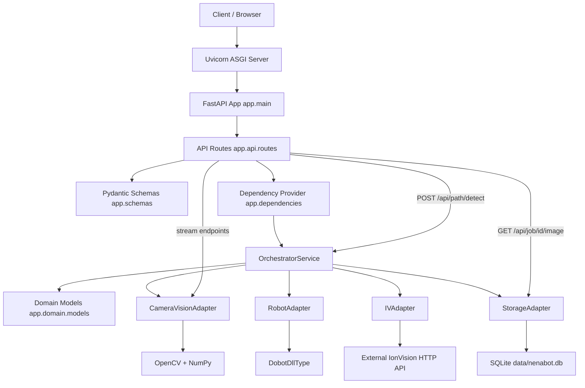

# Architecture Overview

## 1. What this codebase is

This repository is a FastAPI-based orchestrator for hardware and vision workflows.
It exposes HTTP endpoints for health/status, runtime calibration, job lifecycle, live camera streams, and path detection.

The architecture is a single Python service with in-process adapters:

- API layer: request/response handling (`app/api/routes.py`)
- Service layer: orchestration logic (`app/services/orchestrator.py`)
- Adapter layer: hardware/external integrations (`app/adapters/*`)
- Persistence layer: SQLite database via `app/adapters/database.py` + `app/adapters/storage.py`
- Schema/domain layer: data contracts (`app/schemas.py`, `app/domain/models.py`)

The service can run directly or inside a Docker container (see [README](../README.md)).

## 2. What Uvicorn is used for

`uvicorn` is the ASGI server that runs the FastAPI app (`app.main:app`).

In this project, Uvicorn is responsible for:

- Accepting HTTP connections and routing requests into FastAPI
- Serving OpenAPI docs (`/docs`) and JSON schema (`/openapi.json`)
- Keeping long-lived streaming connections open for MJPEG endpoints:
    - `GET /api/stream/camera/feed`
    - `GET /api/stream/detection/feed`
- Serving Server-Sent Events (SSE) for real-time job progress via `GET /api/job/{id}/events`
- Handling robot control endpoints for calibration and manual positioning
- Supporting development reload mode (`--reload`) so code changes restart the server automatically

Typical local run command:

```bash
uvicorn app.main:app --reload
```

## 3. Runtime flow (high level)

1. A client calls an endpoint.
2. FastAPI route handlers in `app/api/routes.py` validate input with Pydantic schemas.
3. FastAPI injects a shared `OrchestratorService` from `app/dependencies.py`.
4. `OrchestratorService` coordinates adapters (`camera_vision`, `robot`, `IVAdapter`, `storage`).
5. Results are returned as schema models (or stream bytes for MJPEG feeds).

Notes about current behavior:

- All job state is persisted in a SQLite database (`data/nenabot.db`) via `Database` + `StorageAdapter`.
- WAL journal mode enables concurrent reads (API thread) and writes (background job thread).
- Captured images are stored as BLOBs in the `job_images` table.
- `IVAdapter` (`app/adapters/ionVision.py`) is an HTTP/WebSocket client to the external IonVision API.
- `CameraVisionAdapter` handles intrinsic-profile loading, shared image capture, checkerboard detection, contour detection, and live stream generation.
- `RobotAdapter` (`app/adapters/robot.py`) wraps Dobot hardware control; supports both job automation and the guided 4-point calibration flow.
- Robot control endpoints:
    - `POST /api/robot/move` — manual positioning for calibration
    - `GET /api/robot/pose` — read current end-effector position and joint angles
    - `POST /api/robot/stop` — halt active job and stop robot motion
- Runtime calibration state is stored in `data/calibration/robot_mapping.json` and surfaced through `GET /api/status`.
- API and internal component naming uses `ionvision` consistently for the IonVision adapter; legacy `dms` env aliases are still accepted by the dependency factory.

## 4. Folder structure (commented tree)

```text
nenabot-main/
|- app/                                  # Application source root
|  |- main.py                            # FastAPI app factory, CORS middleware, router wiring
|  |- dependencies.py                    # Dependency factory + singleton orchestrator provider
|  |- schemas.py                         # Pydantic request/response models used by API
|  |- api/
|  |  |- routes.py                       # HTTP endpoints (health, status, calibration, jobs, profiles, paths, streams, robot control)
|  |- services/
|  |  |- orchestrator.py                 # Core use-case orchestration and in-memory job state
|  |- adapters/
|  |  |- camera_vision.py                # Shared camera capture, checkerboard detection, battery detection, MJPEG streaming
|  |  |- database.py                     # Thin sqlite3 wrapper (WAL mode, foreign keys)
|  |  |- ionVision.py                    # IonVision HTTP/WebSocket adapter (IVAdapter)
|  |  |- robot.py                        # Dobot robot control wrapper
|  |  |- storage.py                      # SQLite-backed persistence (jobs, waypoints, measurements, images)
|  |- domain/
|  |  |- models.py                       # Internal dataclasses (Job, Waypoint, Measurement)
|- tests/
|  |- test_api.py                        # API tests via FastAPI TestClient + dependency overrides
|  |- test_orchestrator.py               # Service-level unit tests (DB-backed)
|  |- test_database.py                   # Database + StorageAdapter unit tests
|- docs/
|  |- architecture-overview.md           # This file
|  |- database.md                        # Database schema and persistence details
|  |- frontend-integration-diagram.md    # Frontend calibration, job, and results sequence diagrams
|  |- vision-calibration.md              # Intrinsic profile + runtime 4-point calibration flow
|  |- raspberry-pi-setup.md              # Raspberry Pi remote access and Cloudflare Tunnel SSH guide
|  |- streaming.md                       # Streaming architecture and usage guide
|  |- calibration-tester.html            # Guided runtime calibration UI
|  |- stream-viewer.html                 # Manual HTML viewer for camera/detection feeds
|  |- job-tester.html                    # Job creation / testing UI
|  |- job-results.html                   # Job results browser with frontend-rendered measurement points
|- Dockerfile                            # Docker image definition (python:3.10-slim)
|- .dockerignore                         # Excludes __pycache__, .git, venv, etc.
|- data/
|  |- nenabot.db                         # SQLite database (auto-created)
|  |- images/                            # Captured image output
|- .github/workflows/                    # CI and notification workflows
|- requirements.txt                      # Python dependencies (runtime + tooling)
|- pyproject.toml                        # Ruff/Black configuration
|- README.md                             # Setup, endpoint summary, contribution guidance
```

## 5. Dependency architecture (Mermaid)



## 6. Practical dependency notes

- Dependency injection is constructor-based at the service layer and provided through FastAPI `Depends`.
- `create_orchestrator(db_path=...)` composes concrete adapters once (including `Database` + `StorageAdapter`), and `get_orchestrator()` reuses that instance.
- Tests override `get_orchestrator` to isolate state, using a per-test temporary SQLite database.
- This keeps route logic thin and centralizes orchestration behavior in one service class.
