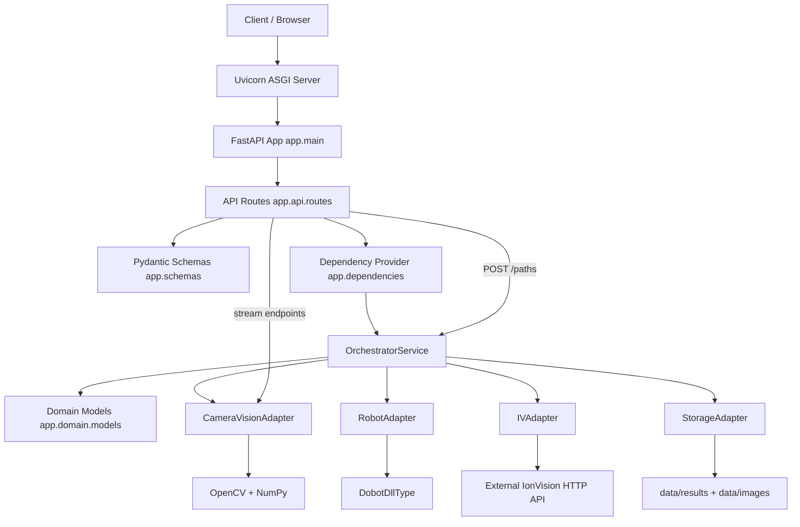

# Architecture Overview

## 1. What this codebase is

This repository is a FastAPI-based orchestrator for hardware and vision workflows.
It exposes HTTP endpoints for health/status, job lifecycle, live camera streams, and path detection.

The architecture is a single Python service with in-process adapters:

- API layer: request/response handling (`app/api/routes.py`)
- Service layer: orchestration logic (`app/services/orchestrator.py`)
- Adapter layer: hardware/external integrations (`app/adapters/*`)
- Schema/domain layer: data contracts (`app/schemas.py`, `app/domain/models.py`)

## 2. What Uvicorn is used for

`uvicorn` is the ASGI server that runs the FastAPI app (`app.main:app`).

In this project, Uvicorn is responsible for:

- Accepting HTTP connections and routing requests into FastAPI
- Serving OpenAPI docs (`/docs`) and JSON schema (`/openapi.json`)
- Keeping long-lived streaming connections open for MJPEG endpoints:
    - `GET /streams/camera/feed`
    - `GET /streams/detection/feed`
- Supporting development reload mode (`--reload`) so code changes restart the server automatically

Typical local run command:

```bash
uvicorn app.main:app --reload
```

## 3. Runtime flow (high level)

1. A client calls an endpoint.
2. FastAPI route handlers in `app/api/routes.py` validate input with Pydantic schemas.
3. FastAPI injects a shared `OrchestratorService` from `app/dependencies.py`.
4. `OrchestratorService` coordinates adapters (`camera_vision`, `robot`, `IVAdapter`, `storage`).
5. Results are returned as schema models (or stream bytes for MJPEG feeds).

Notes about current behavior:

- Job tracking is in-memory (`_jobs`, `_job_order`) in `OrchestratorService`.
- `StorageAdapter` persists result summaries as JSON under `data/results`.
- `IVAdapter` (`app/adapters/ionVision/ionVision.py`) is an HTTP client to the external IonVision API.
- `CameraVisionAdapter` handles image capture, contour detection, and live stream generation.
- Some API/internal fields still use legacy `dms` naming (for example `Health.dms`), while adapter naming is now IonVision/IV.

## 4. Folder structure (commented tree)

```text
nenabot-main/
|- app/                                  # Application source root
|  |- main.py                            # FastAPI app factory, CORS middleware, router wiring
|  |- dependencies.py                    # Dependency factory + singleton orchestrator provider
|  |- schemas.py                         # Pydantic request/response models used by API
|  |- api/
|  |  |- routes.py                       # HTTP endpoints (health, jobs, profiles, paths, streams)
|  |- services/
|  |  |- orchestrator.py                 # Core use-case orchestration and in-memory job state
|  |- adapters/
|  |  |- camera_vision.py                # Camera capture, ArUco/contour detection, MJPEG streaming
|  |  |- ionVision/
|  |  |  |- ionVision.py                 # IonVision HTTP adapter (IVAdapter)
|  |  |- robot.py                        # Dobot robot control wrapper
|  |  |- storage.py                      # File-based JSON persistence for results
|  |- domain/
|  |  |- models.py                       # Internal dataclasses (Job, ResultSummary)
|- tests/
|  |- test_api.py                        # API tests via FastAPI TestClient + dependency overrides
|  |- test_orchestrator.py               # Service-level unit test
|- docs/
|  |- streaming.md                       # Streaming architecture and usage guide
|  |- stream-viewer.html                 # Manual HTML viewer for camera/detection feeds
|- data/
|  |- images/                            # Captured image output
|  |- results/                           # Persisted result JSON files
|- .github/workflows/                    # CI and notification workflows
|- requirements.txt                      # Python dependencies (runtime + tooling)
|- pyproject.toml                        # Ruff/Black configuration
|- README.md                             # Setup, endpoint summary, contribution guidance
```

## 5. Dependency architecture (Mermaid)



## 6. Practical dependency notes

- Dependency injection is constructor-based at the service layer and provided through FastAPI `Depends`.
- `create_orchestrator()` composes concrete adapters once, and `get_orchestrator()` reuses that instance.
- Tests override `get_orchestrator` to isolate state and storage.
- This keeps route logic thin and centralizes orchestration behavior in one service class.
