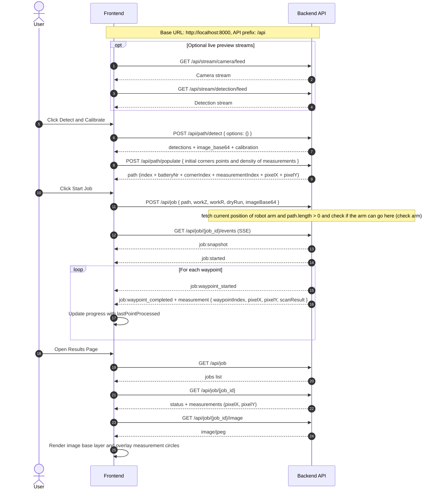

```mermaid
sequenceDiagram
    autonumber
    actor U as User
    participant FE as Frontend
    participant BE as Backend API

    Note over FE,BE: Base URL: http://localhost:8000, API prefix: /api

    opt Optional live preview streams
        FE->>BE: GET /api/stream/camera/feed
        BE-->>FE: Camera stream
        FE->>BE: GET /api/stream/detection/feed
        BE-->>FE: Detection stream
    end

    U->>FE: Click Detect and Calibrate
    FE->>BE: POST /api/path/detect { options: {} }
    BE-->>FE: detections + image_base64 + calibration
    FE->>BE: POST /api/path/populate { initial corners points and density of measurements }
    BE-->>FE: path (index + batteryNr + cornerIndex + measurementIndex + pixelX + pixelY)

    U->>FE: Click Start Job
    FE->>BE: POST /api/job { path, workZ, workR, dryRun, imageBase64 }
    Note over BE: fetch current position of robot arm and path.length > 0 and check if the arm can go here (check arm)


    FE->>BE: GET /api/job/{job_id}/events (SSE)
    BE-->>FE: job:snapshot
    BE-->>FE: job:started

    loop For each waypoint
        BE-->>FE: job:waypoint_started
        BE-->>FE: job:waypoint_completed + measurement { waypointIndex, pixelX, pixelY, scanResult }
        FE->>FE: Update progress with lastPointProcessed
    end

    U->>FE: Open Results Page
    FE->>BE: GET /api/job
    BE-->>FE: jobs list
    FE->>BE: GET /api/job/{job_id}
    BE-->>FE: status + measurements (pixelX, pixelY)
    FE->>BE: GET /api/job/{job_id}/image
    BE-->>FE: image/jpeg
    FE->>FE: Render image base layer and overlay measurement circles
```
