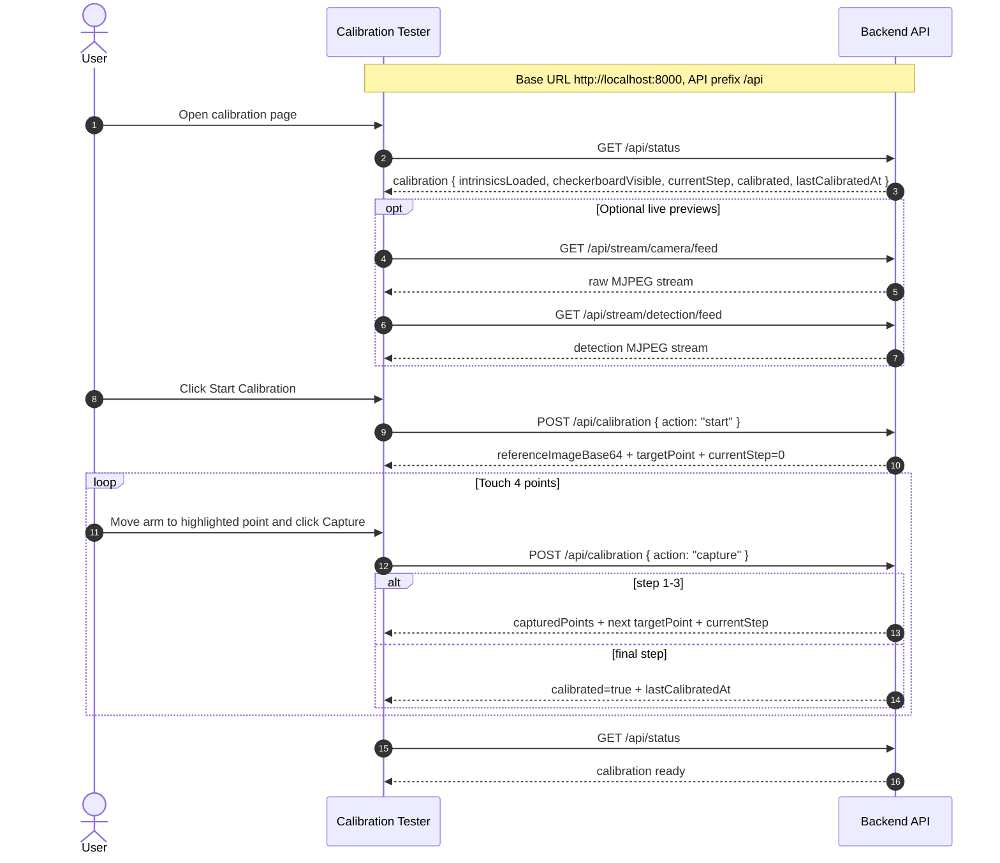
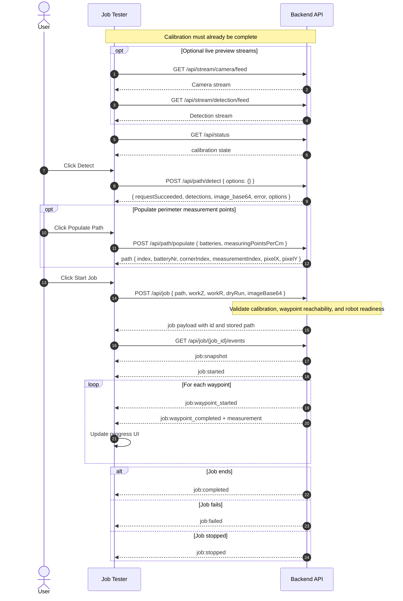
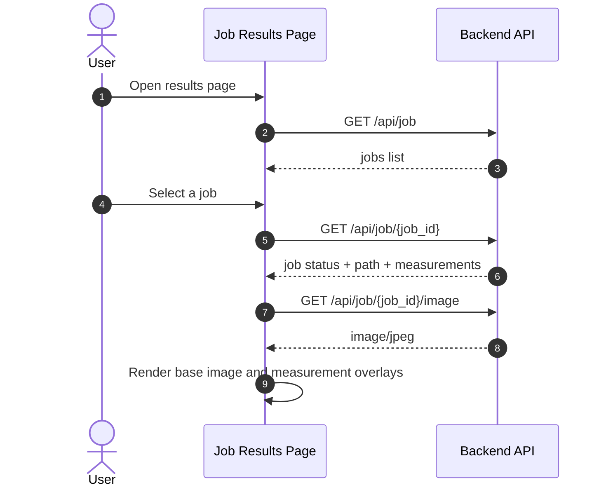

# Frontend Integration

This document summarizes the current frontend-to-backend interaction model for calibration, path planning, job execution, and results browsing.

The frontend talks only to the FastAPI backend under the `/api` prefix.

## Runtime Calibration

Calibration is no longer part of `POST /api/path/detect`.

- The frontend reads calibration state from `GET /api/status`.
- The calibration tester drives the guided 4-point flow through `POST /api/calibration`.
- Live preview uses the shared raw and detection streams.

## Detection, Path Planning, And Job Execution

The job tester flow is separate from calibration.

- `POST /api/path/detect` returns only detections and the latest snapshot.
- `POST /api/path/populate` converts detection contours into perimeter measurement points.
- `POST /api/job` converts pixel points into robot waypoints and starts the job.
- `GET /api/job/{job_id}/events` is the realtime progress stream.

## Results Flow

The results page is read-only and reconstructs the overlay client-side.

## Endpoint Summary

- `GET /api/status`
- `POST /api/calibration`
- `GET /api/stream/camera/feed`
- `GET /api/stream/detection/feed`
- `POST /api/path/detect`
- `POST /api/path/populate`
- `POST /api/job`
- `GET /api/job/{job_id}/events`
- `GET /api/job`
- `GET /api/job/{job_id}`
- `GET /api/job/{job_id}/image`
