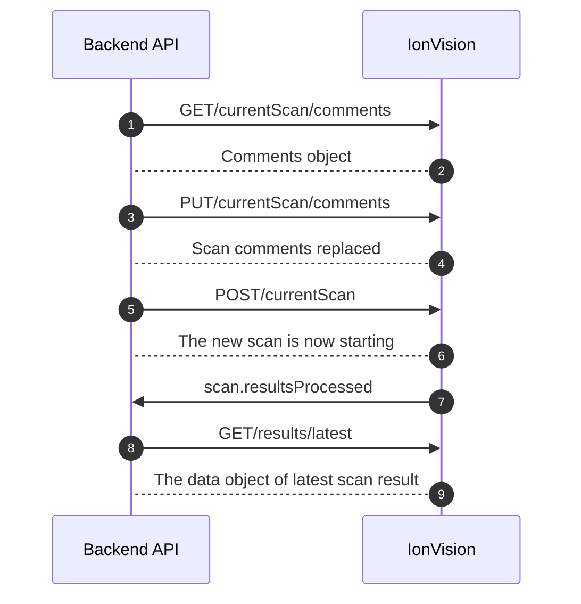

# IonVision Adapter Documentation

Main adapter interface for IonVision device communication via the HTTP and
WebSocket APIs.
**IonVision HTTP API Documentation**: https://olfactomics.github.io/IonVision-API-docs/
**IonVision WebSocket API Documentation**: https://github.com/Olfactomics/IonVision-API-docs/blob/main/IonVision-WS-API.md

## Key Responsibilities

1. **HTTP API wrapper:** Methods for scan management.
   Most importants: get_scan_comments(), replace_scan_comments(comments:dict), start_new_scan(),
   get_current_scan(), get_latest_dataobject()

2. **WebSocket event handling**
   Lifecycle management and event registration for real-time device notifications.

## Core HTTP Methods

**get_scan_comments()** <br>
Get the comments object associated with the ongoing or next scan.
The comments object is automatically reset once a scan finishes
and the previous comments object is saved to the result file
of the just finished scan.

**replace_scan_comments(comments:dict)** <br>
Parameters:

- `comments` (dict): Key-value pairs representing scan comments/metadata to store

Description: <br>
Add comments to the ongoing or next scan. Replaces the previous comments object.
The /currentScan/comments object can first be fetched for editing using GET.

**get_current_scan()** <br>
Check if a scan is ongoing and get information about it.

**get_latest_dataobject()** <br>
Get the data object of the latest scan result once it has been processed.
Please note that it can take some time for the device to process the scan
result data after a scan has already been finished.

## Core WebSocket Methods

IonVision websocket traffic is one-way from the device to the client. Each
message is a JSON object with `type`, `time`, and `body` keys. The adapter
passes that full parsed message to registered handlers.

Example:

```json
{
    "type": "controllers.status",
    "time": 1616057824108,
    "body": {
        "status": {
            "rtmReady": true
        }
    }
}
```

**initialize_websocket()** <br>
Initialize WebSocket connection for event streaming.
Must be called after instantiation to open the WebSocket.

**disconnect_websocket()** <br>
Close WebSocket connection and stop listening for events.

**on_event(event_type: str, handler: Callable[[Dict[str, Any]], Any])** <br>
Parameters:

- event_type: The type of event to listen for (e.g., "message.error", "scan.finished")
- handler: Async or sync callable that receives the full websocket message
  object with `type`, `time`, and `body`

Description:
Register a handler for a WebSocket event.

**off_event(event_type: str, handler: Callable[[Dict[str, Any]], Any])** <br>
Parameters:

- event_type: The type of event to stop listening for (e.g., "message.error", "scan.finished")
- handler: The previously registered callback to remove

Description:
Unregister a handler for a WebSocket event.

## Internal Architecture

- Delegates WebSocket management to WebSocketAdapter class
- Returns IVResult objects (with ok, payload, error fields) for HTTP calls
- Dispatches websocket events by `type`
- Keeps the full documented IonVision websocket envelope intact for handlers

## Sequence Diagram: Successful IonVision-Backend Communication Flow



---

## Hardware Integration Tests

The hardware test suite lives at `tests/test_ionvision_hardware.py` and is marked
`@pytest.mark.hardware` + `@pytest.mark.ionvision`. CI excludes these markers, so
tests are never run automatically — they must be triggered manually when connected
to the device.

### What the tests cover

Read-only:

- `GET /currentParameter` via `IVAdapter.ping()`
- `GET /currentParameter` via `IVAdapter.get_parameter_ID()`
- `GET /currentScan/comments`
- `GET /results`
- `GET /results/latest`
- `GET /results/id/{id}`
- `GET /results/id/{id}/comments`

Optional (enabled by default, disable with env vars):

- Starting and stopping a scan, verifying `scan.stopped` over WebSocket
- Updating and restoring current scan comments (mutation)
- Updating and restoring stored result comments (mutation)
- WebSocket connect and receipt of a `controllers.status` event
- Full scan completion and receipt of `scan.resultsProcessed`

### Before you run

1. Make sure your machine can reach the IonVision device over the network.
2. Confirm the device is idle before running the scan lifecycle tests.
3. Activate the virtualenv:

```bash
source .venv/bin/activate
```

### Running the tests

Connection defaults to `http://192.168.1.109/api` and `ws://192.168.1.109/socket`.
All settings can be overridden with environment variables.

```bash
IONVISION_RUN_HARDWARE_TESTS=1 pytest -s -v tests/test_ionvision_hardware.py
```

Override connection settings for a different device:

```bash
IONVISION_RUN_HARDWARE_TESTS=1 \
IONVISION_BASE_URL=http://<device-ip>/api \
pytest -s -v tests/test_ionvision_hardware.py
```

### Environment variables

All variables are optional — hardcoded defaults are used if not set.

| Variable                                     | Default                     | Description                                                        |
| :------------------------------------------- | :-------------------------- | :----------------------------------------------------------------- |
| `IONVISION_RUN_HARDWARE_TESTS`               | —                           | Set to `1` to enable the suite                                     |
| `IONVISION_BASE_URL`                         | `http://192.168.1.109/api`  | IonVision HTTP base URL                                            |
| `IONVISION_WS_BASE_URL`                      | `ws://192.168.1.109/socket` | WebSocket URL (derived from base URL if omitted)                   |
| `IONVISION_REQUEST_TIMEOUT_S`                | `10.0`                      | Per-request timeout in seconds                                     |
| `IONVISION_ENABLE_MUTATION_TESTS`            | `true`                      | Allow scan start/stop and comment writes                           |
| `IONVISION_RUN_WS_TEST`                      | `true`                      | Enable WebSocket tests                                             |
| `IONVISION_WS_EVENT_TIMEOUT_S`               | `10.0`                      | Timeout for quick WS events (`controllers.status`, `scan.stopped`) |
| `IONVISION_SCAN_RESULTS_PROCESSED_TIMEOUT_S` | `120.0`                     | Timeout waiting for `scan.resultsProcessed`                        |
| `IONVISION_RESULTS_MAX_RESULTS`              | `100`                       | Max results returned from `/results`                               |
| `IONVISION_RESULTS_PAGE`                     | —                           | Page number (uses device default if unset)                         |
| `IONVISION_RESULTS_START_DATE`               | `2026-03-17T13:01:11.874Z`  | Results query start date                                           |
| `IONVISION_RESULTS_END_DATE`                 | `2026-03-25T13:01:11.874Z`  | Results query end date                                             |
| `IONVISION_RESULTS_SORT_BY`                  | `date_dsc`                  | Results sort order                                                 |
| `IONVISION_RESULTS_ONLY_METADATA`            | `true`                      | Return metadata only (no full data objects)                        |
| `IONVISION_RESULTS_IDS`                      | —                           | Comma-separated result IDs to filter by                            |

### Running specific tests

WebSocket connectivity only:

```bash
IONVISION_RUN_HARDWARE_TESTS=1 \
pytest -s -v tests/test_ionvision_hardware.py::test_websocket_endpoint_accepts_connections
```

Scan lifecycle (start + stop) only:

```bash
IONVISION_RUN_HARDWARE_TESTS=1 \
IONVISION_ENABLE_MUTATION_TESTS=1 \
pytest -s -v tests/test_ionvision_hardware.py::test_scan_lifecycle_start_and_stop
```

Full scan completion (waits for `scan.resultsProcessed`):

```bash
IONVISION_RUN_HARDWARE_TESTS=1 \
IONVISION_ENABLE_MUTATION_TESTS=1 \
IONVISION_RUN_WS_TEST=1 \
pytest -s -v tests/test_ionvision_hardware.py::test_websocket_scan_results_processed_event
```

### Safety notes

- The current-scan test starts a scan itself and stops it after reading `/currentScan` — it does not interfere with a scan already in progress.
- If `POST /currentScan` returns a 409 conflict, the lifecycle test skips rather than probing scan state blindly.
- Mutation tests (comment updates) restore the original comment objects after verification.

### Verifying through the backend

You can also point the backend at the real device to check the `/health` endpoint:

```bash
IONVISION_BASE_URL=http://192.168.1.109/api \
IONVISION_WS_BASE_URL=ws://192.168.1.109/socket \
uvicorn app.main:app --reload
```

```bash
curl http://127.0.0.1:8000/api/health
```

The `ionvision` component should report `connected` if the adapter can reach the device.

### Example output (13 tests, all passing)

```
============================= test session starts ==============================
platform darwin -- Python 3.10.8, pytest-8.3.2, pluggy-1.6.0
rootdir: /Users/jb/Documents/DEV/TUNI/PROJ/nenabot-main
configfile: pytest.ini
collected 13 items

test_ionvision_hardware.py ping payload:
{"parameter": {"id": "32283638-...", "name": "Laser Wellplate"}}
.currentParameter payload:
{"parameter": {"id": "32283638-...", "name": "Laser Wellplate"}}
.start_new_scan payload:
{"message": "The scan is starting"}
currentScan payload:
{"information": {}, "progress": 99}
stop_current_scan payload:
{"message": "The scan is stopping"}
.currentScan/comments payload: {}
.results payload: {"meta": {"totalResults": 120, ...}, "results": [...]}
.results/latest payload: {"Id": "371a6a5c-...", "FinishTime": "2026-03-24T14:00:55.563Z", ...}
.results/id payload: {...}
.results/id/comments payload: {}
.websocket connection succeeded: ws://192.168.1.109/socket
.scan.resultsProcessed received: {"body": {}, "time": 1774360886651, "type": "scan.resultsProcessed"}
.

============================= 13 passed in 16.86s ==============================
```
