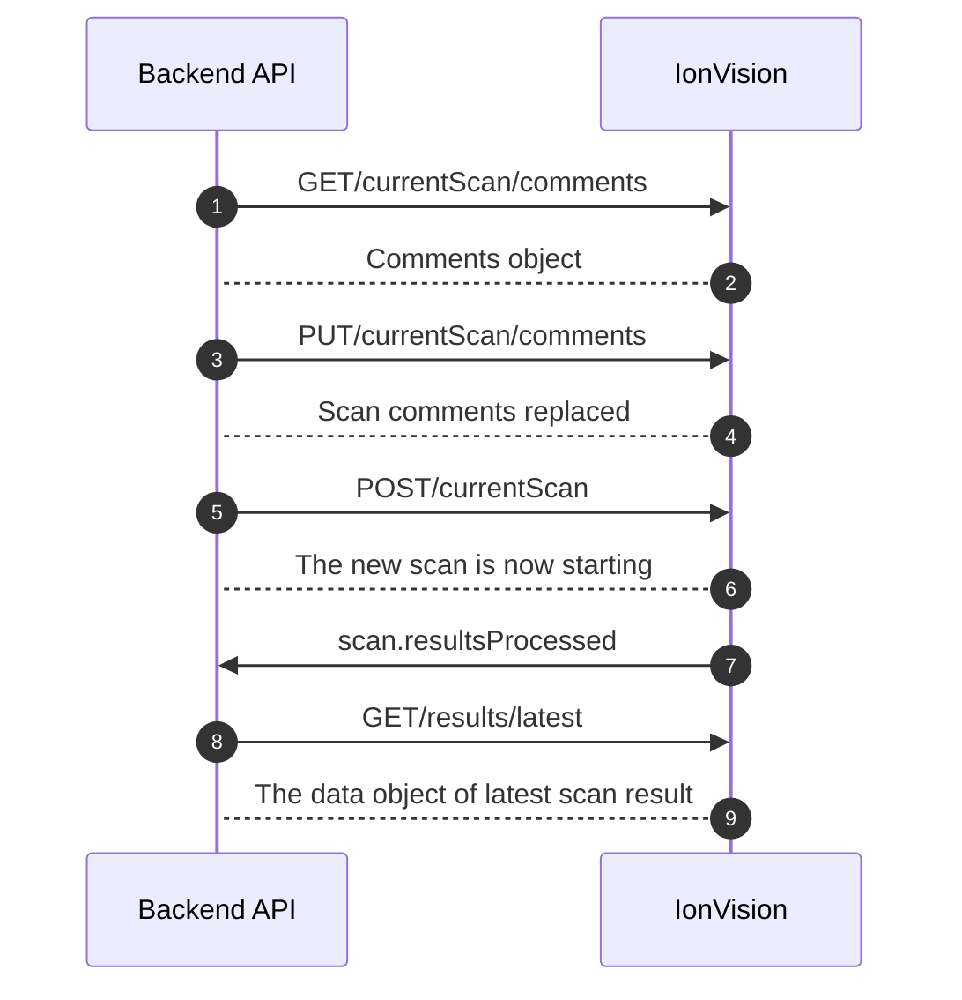

# IonVision adapter Documentation
Main adapter interface for IonVision device communication via HTTP and WebSocket APIs.
**IonVision HTTP API Documentation**: https://olfactomics.github.io/IonVision-API-docs/
**IonVision WebSocket API Documentation**: https://github.com/Olfactomics/IonVision-API-docs/blob/main/IonVision-WS-API.md

## Key Responsibilities

1. **HTTP API wrapper:** Methods for scan management. 
Most importants: get_scan_comments(), replace_scan_comments(comments:dict), start_new_scan(),
get_current_scan(), get_latest_dataobject()

2. **WebSocket event handling**
Lifecycle management and event registration for real-time device notifications

## Core HTTP Methods
**get_scan_comments()**
Get the comments object associated with the ongoing or next scan.
The comments object is automatically reset once a scan finishes 
and the previous comments object is saved to the result file 
of the just finished scan.

**replace_scan_comments(comments:dict)**
Parameters:
- `comments` (dict): Key-value pairs representing scan comments/metadata to store
Description:
Add comments to the ongoing or next scan. Replaces the previous comments object.
The /currentScan/comments object can first be fetched for editing using GET.

**get_current_scan()**
Check if a scan is ongoing and get information about it.

**get_latest_dataobject()**
Get the data object of the latest scan result once it has been processed.
Please note that it can take some time for the device to process the scan 
result data after a scan has already been finished. 

## Core WebSocket Methods
**initialize_websocket()**
Initialize WebSocket connection for event streaming.
Must be called after instantiation to open the WebSocket.

**disconnect_websocket()**
Close WebSocket connection and stop listening for events.

**on_event(event_type: str, handler: Callable[[Dict[str, Any]], Any])**
Parameters:
- event_type: The type of event to listen for (e.g., "message.error", "scan.finished")
- handler: Async or sync callable that receives the event data dict
Description:
Register a handler for a WebSocket event.

**off_event(event_type: str, handler: Callable[[Dict[str, Any]], Any])**
Parameters:
- event_type: The type of event to stop listening for (e.g., "message.error", "scan.finished")
- handler: Async or sync callable that receives the event data dict
Description:
Unregister a handler for a WebSocket event.

## Internal Architecture
- Delegates WebSocket management to WebSocketAdapter class
- Returns IVResult objects (with ok, payload, error fields) for HTTP calls

## Sequence Diagram: Successful IonVision-Backend Communication Flow

