# Current Job Flow

This document focuses on the current job-creation flow: what the backend serves to the frontend, what the frontend manipulates locally, what gets sent back to the backend, and what the backend then stores and executes.

## General Job Creation Flow

```mermaid
flowchart LR
    A[User opens job tester page] --> B[Frontend requests POST /api/paths]
    B --> C[Backend captures image and runs detection]
    C --> D[Backend returns detection payload to frontend]
    D --> E[Frontend stores local state]
    E --> F[User edits path on canvas]
    F --> G[Frontend sends POST /api/jobs]
    G --> H[Backend validates calibration and converts pixels to robot waypoints]
    H --> I[Backend stores job image path and metadata]
    I --> J[Backend starts background job execution]
    J --> K[Frontend receives progress via SSE or polling]
```

## Data Ownership By Step

| Step | Served by backend to frontend | Manipulated in frontend | Sent back to backend | Manipulated in backend |
| :--- | :--- | :--- | :--- | :--- |
| Detect path | `detections`, `image_base64`, `markerCorners`, `pixelsPerMm`, `calibration` from `POST /api/paths` | Frontend stores `lastDetections`, `lastSnapshotBase64`, `lastMarkerCorners`, `calibration` | Nothing yet | Backend captures image, reads robot pose, computes calibration and canvas start |
| Build editable path | Initial path inferred from detection corners | Frontend builds and edits `detectedPath` on the canvas with add, move, delete | Nothing yet | Nothing yet |
| Confirm job | Existing calibration data already shown in UI | Frontend combines `detectedPath`, `workZ`, `workR`, `dryRun`, `imageBase64` into request body | `path` in pixel coordinates, `workZ`, `workR`, `dryRun`, `imageBase64` to `POST /api/jobs` | Backend checks that calibration exists |
| Create job | Response includes created job with converted robot path and initial status | Frontend stores `currentJobId` and renders status | Nothing extra | Backend converts pixel points to robot waypoints, stores pixel path separately, stores image, creates DB job row |
| Execute job | SSE snapshot and progress events, or `GET /api/jobs/{job_id}` polling data | Frontend updates status UI and measurement table | `POST /api/robot/stop` only if user stops the run | Backend moves robot, optionally scans IonVision, stores measurements and job state, publishes events |

## What Lives Where

### Backend serves to the frontend

- `POST /api/paths` returns the clean captured image as `image_base64`.
- `POST /api/paths` returns detection geometry: battery corners, marker corners, and `pixelsPerMm`.
- `POST /api/paths` returns calibration data: `robotStart`, `canvasStart`, and `pixelsPerMm`.
- `POST /api/jobs` returns the created job object with backend-converted robot waypoints and initial status.
- `GET /api/jobs/{job_id}/events` returns live progress events.
- `GET /api/jobs/{job_id}` returns persisted job state and measurements.
- `GET /api/jobs/{job_id}/image` returns the stored clean job image.

### Manipulated only in the frontend before job creation

- `detectedPath` is built in the browser from detection corners.
- The user can add, move, delete, and reorder the effective path visually on the canvas.
- `workZ`, `workR`, and `dryRun` are chosen in the UI.
- The confirmation step assembles the final request body from frontend state.
- No backend job exists yet while the user is still editing the path.

### Sent from frontend to backend when creating the job

- `path`: array of pixel points from the edited canvas path.
- `workZ` and `workR`: work coordinates applied to every converted waypoint.
- `dryRun`: whether the backend should simulate instead of moving the robot.
- `imageBase64`: the clean snapshot previously returned by `POST /api/paths`.

### Manipulated only in the backend after job creation

- Calibration is used to convert pixel points to robot millimeter waypoints through `pixel_to_robot()`.
- The pixel path is stored separately so completed measurements can keep `pixelX` and `pixelY` for browser overlays.
- The clean image is decoded and persisted as the job base image.
- The job is saved to SQLite, marked `running`, and executed in a background thread.
- For each waypoint, the backend may move the robot, validate arrival, dwell, request a scan from IonVision, and save a measurement.
- The backend publishes SSE progress events and persists terminal state such as `completed`, `failed`, or `stopped`.

## Current-State Flow

```mermaid
flowchart TD
    subgraph Frontend[Frontend pages opened locally in the browser]
        JT[docs/job-tester.html]
        JR[docs/job-results.html]
        Canvas[Local canvas state\ndetectedPath calibration snapshot]
    end

    subgraph API[FastAPI app /api]
        CAM[GET /streams/camera/feed]
        DET[GET /streams/detection/feed]
        PATHS[POST /paths]
        JOBS[POST /jobs]
        JOBLIST[GET /jobs]
        JOBGET[GET /jobs/job_id]
        JOBIMG[GET /jobs/job_id/image]
        JOBEV[GET /jobs/job_id/events]
        MOVE[POST /robot/move]
        POSE[GET /robot/pose]
        STOP[POST /robot/stop]
    end

    subgraph Service[OrchestratorService]
        Detect[detect_path]
        Create[create_job]
        Run[run_job background thread]
        Execute[_execute_job loop]
        Publish[Publish SSE events]
        Convert[Convert pixel path to robot waypoints]
    end

    subgraph Adapters[Adapters and external systems]
        Camera[CameraVisionAdapter]
        Robot[RobotAdapter]
        DMS[IVAdapter / IonVision]
        Storage[StorageAdapter + SQLite]
    end

    JT -->|start raw stream| CAM
    JT -->|start overlay stream| DET
    CAM --> Camera
    DET --> Camera

    JT -->|Detect| PATHS
    PATHS --> Detect
    Detect -->|capture image + detect contours + markers| Camera
    Detect -->|read current robot pose for calibration| Robot
    Detect -->|return detections image_base64 marker corners calibration| JT
    JT --> Canvas
    Canvas -->|user adds moves deletes waypoints locally| Canvas

    JT -->|Read Pose debug| POSE
    POSE --> Robot
    JT -->|Test Move debug| MOVE
    MOVE --> Robot

    Canvas -->|Confirm start with pixel waypoints workZ workR dryRun imageBase64| JOBS
    JOBS -->|reject if not calibrated| Create
    JOBS --> Convert
    Convert -->|pixel_to_robot using stored calibration| Create
    Create -->|save job snapshot and pixel path| Storage
    Create --> Run
    Run --> Execute

    Execute -->|for each waypoint move wait dwell| Robot
    Execute -->|start and poll scan on real jobs| DMS
    Execute -->|save measurement + state| Storage
    Execute --> Publish
    JT <-->|EventSource SSE primary monitor| JOBEV
    JOBEV --> Publish
    JT -->|fallback polling on SSE error| JOBGET
    JOBGET --> Storage
    JT -->|Stop| STOP
    STOP --> Robot

    JR -->|load job list| JOBLIST
    JOBLIST --> Storage
    JR -->|load selected job details| JOBGET
    JR -->|load stored base image| JOBIMG
    JOBIMG --> Storage
    JR -->|poll selected job every 1.2s while running| JOBGET
    JR -->|draw measurement circles client-side from pixelX pixelY| JR
```

## What Happens Today

1. The tester page talks directly to the backend from a local HTML file. It starts the MJPEG camera and detection streams with `GET /streams/camera/feed` and `GET /streams/detection/feed`.
2. Clicking `Detect` calls `POST /paths`. The backend captures an image, runs detection, reads the robot's current pose, computes calibration from the first marker, and returns the clean snapshot plus detection data.
3. The tester page converts that detection response into a local `detectedPath` on the canvas. Any add, move, or delete action only changes browser state at this point.
4. Clicking `Start Job` or `Dry Run` sends the current pixel waypoints to `POST /jobs` together with `workZ`, `workR`, `dryRun`, and the stored snapshot image.
5. The backend refuses job creation unless calibration already exists from `POST /paths`. If calibrated, it converts each pixel waypoint to robot coordinates, stores the job and image, and starts a background execution thread immediately.
6. During execution, the orchestrator moves the robot for each waypoint, waits for arrival, dwells, optionally talks to IonVision for a scan, stores a measurement, and emits SSE progress events.
7. The tester page primarily monitors progress through `GET /jobs/{job_id}/events` using `EventSource`. If SSE fails, it falls back to polling `GET /jobs/{job_id}`.
8. The results page is read-only. It loads jobs with `GET /jobs`, loads a selected job with `GET /jobs/{job_id}`, fetches the stored base image with `GET /jobs/{job_id}/image`, and draws measurement markers client-side from stored `pixelX` and `pixelY` values.

## Important Current Behaviors

- Calibration is captured only when `POST /paths` runs. The tester must call `Detect` while the robot is already at the intended start position.
- The editable waypoint path exists only in the browser until `POST /jobs` is sent.
- The backend stores the clean image, not an annotated overlay. Both frontend pages draw overlays in the browser.
- The tester page uses SSE for live progress. The results page does not use SSE and instead polls job details while a selected job is still running.
- `POST /robot/move` and `GET /robot/pose` are debug and calibration helpers exposed to the tester page, not part of the normal read-only results flow.
