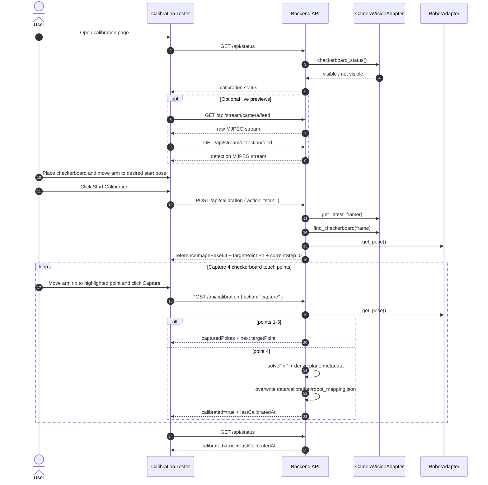

# Vision Calibration

Nenabot now uses a two-part calibration model:

1. A precomputed intrinsic camera profile JSON.
2. A runtime 4-point robot mapping JSON.

## Files

| File | Purpose |
| :--- | :------ |
| `data/calibration/camera_params.json` | Default intrinsic camera profile loaded at startup unless `NENABOT_INTRINSICS_PATH` is set. |
| `data/calibration/robot_mapping.json` | Runtime 4-point robot mapping written by `POST /api/calibration`. This file is overwritten on successful recalibration. |
| `data/calibration/robot_mapping.json.example` | Example solved runtime mapping file shape for development and testing. |

## Intrinsics

Intrinsics are camera-specific and are expected to be created offline.

The backend loads:

- `camera_matrix`
- `dist_coeff`
- `resolution`
- optional checkerboard metadata

The live runtime calibration must use the same camera resolution as the intrinsic file. The backend adopts the intrinsic-file resolution automatically so the highlighted checkerboard points match the saved camera model.

If the intrinsic JSON is missing or invalid:

- `GET /api/status` reports `intrinsicsLoaded = false`
- runtime calibration cannot complete
- job creation remains blocked

## Offline Intrinsic Reference

The current intrinsic workflow and defaults were carried over into the production docs so the old helper scripts are no longer needed as a reference.

### Board And Capture Setup

- Print an A3 chessboard with `9 x 7` squares, which gives `8 x 6` inner corners.
- Use `34 mm` square size.
- Capture at `1920 x 1080`.
- Disable autofocus if the camera supports it.
- Save raw frames, not annotated previews.
- Collect at least `10` valid images with visible corners at different positions and angles.

### Detection And Solver Settings

- Detect corners with `cv2.findChessboardCorners(gray, (8, 6), None)`.
- Refine corners with `cv2.cornerSubPix(..., (11, 11), (-1, -1), criteria)`.
- Use termination criteria:
  - `cv2.TERM_CRITERIA_EPS + cv2.TERM_CRITERIA_MAX_ITER`
  - `30` iterations
  - `0.001` epsilon
- Use `cv2.calibrateCameraRO(...)`.
- Use `iFixedPoint = CHESSBOARD_SIZE[0] - 1`, which is `7` for the current board.
- Use `cv2.CALIB_FIX_K3`.

### Current Intrinsic Reference Values

The checked-in intrinsic file at `data/calibration/camera_params.json` currently contains:

- `reprojection_error`: `0.3507966207095432`
- `resolution`: `[1920, 1080]`
- `camera_matrix`:

```json
[
  [1414.9982096106012, 0.0, 999.6602619306913],
  [0.0, 1421.322506571997, 553.4018128803654],
  [0.0, 0.0, 1.0]
]
```

- `dist_coeff`:

```json
[
  [0.028181033470158042, -0.12745771314004478, -0.0008923510742656439, 0.000397510495505306, 0.0]
]
```

### Visual Validation

The original development flow validated the intrinsic file by showing raw and undistorted images side by side and saving comparison pairs. That validation is still useful:

- compare raw vs undistorted at `1920 x 1080`
- verify straight board edges remain straight after undistortion
- verify the full board remains visible after applying the optimal new camera matrix

Regenerate intrinsics when any of these change:

- camera hardware
- lens or focus setup
- capture resolution
- camera mounting that affects focus or framing enough to require a new model

## Runtime 4-Point Calibration

Open [`docs/calibration-tester.html`](./calibration-tester.html) and follow the guided flow:

1. Ensure the checkerboard is visible in the camera.
2. Move the robot to the desired start pose.
3. Press **Start Calibration**.
4. The backend captures the current frame, detects the checkerboard, stores the start pose, and returns the first target point.
5. Move the robot tip to the highlighted point and press **Capture Current Point**.
6. Repeat until all 4 points are captured.
7. After the 4th point, the backend solves the mapping and overwrites `data/calibration/robot_mapping.json`.

### Sequence Diagram



The fixed checkerboard sequence is:

- `P1 (1, 0)`
- `P2 (1, 6)`
- `P3 (5, 7)`
- `P4 (5, 0)`

These are the four runtime points that define the board orientation and keep the arm inside the reachable workspace. The detection overlay draws the true `row+` and `col+` board directions from the checkerboard geometry so the operator can confirm the orientation before capturing points.

### Original Reference Touch Data

The initial calibration work used these touched robot coordinates for the same checkerboard indices:

| Point | Grid Index | Robot XYZ (mm) |
| :--- | :--- | :--- |
| `P1` | `(1, 0)` | `[309.48, 122.53, -50.84]` |
| `P2` | `(1, 6)` | `[319.28, -88.30, -50.35]` |
| `P3` | `(5, 7)` | `[187.17, -132.45, -51.31]` |
| `P4` | `(5, 0)` | `[175.21, 121.45, -50.41]` |

These values are reference data only. Production calibration always overwrites them with the current robot touch points from the live session.

### Runtime Solve Math

The runtime solve matches the original development approach:

- detect the four image-space checkerboard points
- capture the matching robot-space XYZ points
- solve camera-to-robot extrinsics with `cv2.solvePnP`
- store `rvec` and `tvec`
- derive board plane metadata from the touched points:
  - plane origin
  - board `x_axis`
  - board `y_axis`
  - plane normal

Pixel-to-robot mapping then:

1. undistorts the pixel with the intrinsic model
2. converts the pixel to a camera ray
3. transforms the ray into robot space with the solved rotation/translation
4. intersects that ray with the solved checkerboard plane
5. uses the resulting robot-space `x,y` together with the requested absolute `workZ` and `workR`

The production mapper stores plane metadata explicitly in `robot_mapping.json` instead of relying on an ad-hoc hardcoded plane point.

### Practical Development Notes

The original calibration experiments also surfaced these useful operational defaults:

- a safe board-height test Z is usually around `-48.0 mm`
- the old click-to-move prototype used temporary trim offsets:
  - `X_OFFSET = -2.0`
  - `Y_OFFSET = -2.0`
- a conservative Dobot working-radius band for manual testing was:
  - `160 mm < sqrt(x^2 + y^2) < 330 mm`

Those values are not hardcoded into the main calibration math, but they remain useful when debugging manual moves and calibration accuracy.

## Mapping File Contents

`robot_mapping.json` stores:

- `calibrated_at`
- `intrinsics_path`
- `resolution`
- `checkerboard`
- `image_points`
- `robot_points`
- `start_pose`
- `rvec`
- `tvec`
- `plane`

`calibrated_at` is surfaced through `GET /api/status` as `lastCalibratedAt` so the frontend can show when calibration was last completed.

The example mapping file in `data/calibration/robot_mapping.json.example` is a useful reference for the exact JSON structure:

- `checkerboard.fixed_points` stores the four runtime grid indices
- `image_points` stores the matching pixel coordinates
- `robot_points` stores the captured arm positions
- `plane` stores the solved board frame in robot space

## Status API

`GET /api/status` returns:

- `intrinsicsLoaded`
- `checkerboardVisible`
- `calibrationInProgress`
- `currentStep`
- `totalSteps`
- `calibrated`
- `lastCalibratedAt`

This is the only status endpoint the calibration UI needs.
